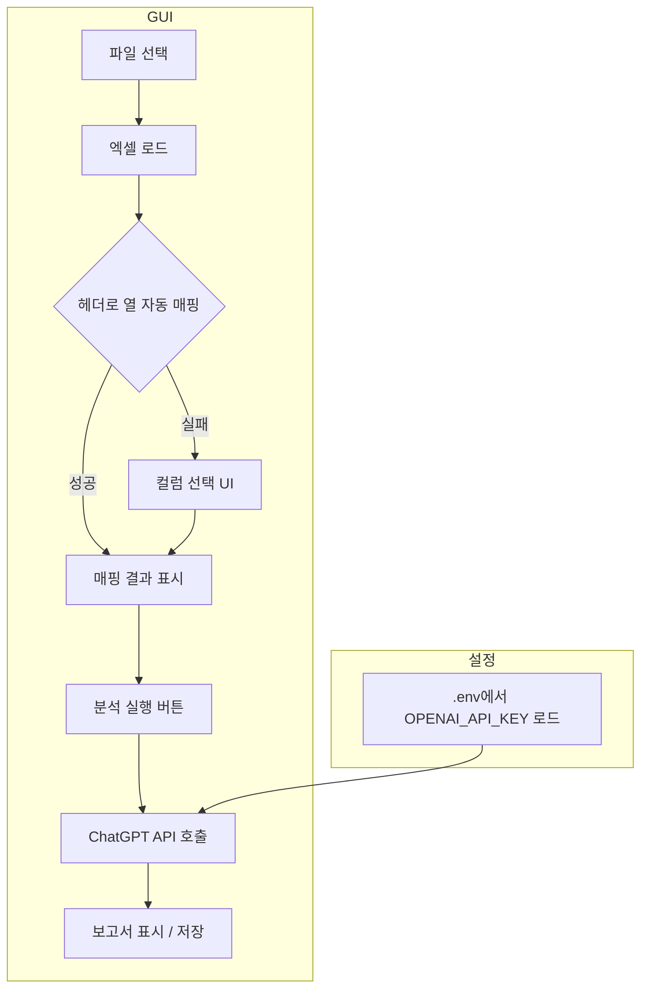

# 고객 리뷰 분석 GUI 프로그램 구현 계획

## 목표

- **GUI**: 파일 선택, 열 매핑(자동 감지 실패 시 사용자 선택), 분석 실행, 보고서 표시/저장
- **단계적 폴백**: 헤더 이름 매칭 → 매칭 실패 시 화면에서 열 선택
- **보고서 생성**: 리뷰 데이터 요약을 ChatGPT API에 전달해 분석 보고서 텍스트 생성
- **API 키**: `.env` 파일에 저장, 사용자가 직접 입력

---

## 기술 스택


| 용도          | 선택                                     |
| ----------- | -------------------------------------- |
| GUI         | **Tkinter** (Python 기본 내장, 추가 설치 없음)   |
| 엑셀 읽기       | pandas + openpyxl                      |
| 환경 변수       | python-dotenv                          |
| ChatGPT API | openai (OpenAI 공식 패키지, ChatGPT API 호출) |


---

## 프로젝트 구조

```
24.Customer_Review_Analysis/
├── .env                    # OPENAI_API_KEY=sk-... (사용자 작성, .gitignore 권장)
├── .env.example            # OPENAI_API_KEY= 항목만 있는 샘플
├── requirements.txt        # pandas, openpyxl, python-dotenv, openai
├── main.py                 # GUI 진입점
├── excel_loader.py         # 엑셀 로드 + 단계적 폴백 열 매핑
├── report_generator.py     # ChatGPT API 호출 및 보고서 생성
└── (선택) config.py        # 열 이름 후보 목록 등 상수
```

---

## 구현 흐름




---

## 1. .env 및 API 키

- **.env** (프로젝트 루트): `OPENAI_API_KEY=sk-...` 한 줄. 사용자가 직접 입력.
- **.env.example**: `OPENAI_API_KEY=` 만 적어 두어 항목 이름 안내.
- **로드**: `python-dotenv`로 `load_dotenv()` 후 `os.getenv("OPENAI_API_KEY")`. API 호출 전에 키 없으면 GUI에서 경고 메시지 표시.

---

## 2. 엑셀 로드 및 단계적 폴백 (excel_loader.py)

- **역할별 헤더 후보** (상수 또는 config):
  - 리뷰: `["리뷰내용", "리뷰 내용", "Review", "review_content", "리뷰"]`
  - 평점: `["평점", "점수", "rating", "Rating", "별점"]`
  - 모델: `["구매한 노트북 모델", "노트북 모델", "모델", "product", "제품명"]`
  - 고객ID: `["고객ID", "고객 id", "customer_id", "ID"]`
  - 이름: `["이름", "name", "Name", "고객명"]`
- **동작**:
  - `load_excel(path, sheet_name=0)` → DataFrame 반환.
  - `resolve_columns(df)` → 헤더 이름 후보로 매칭해 `{"리뷰": "열이름", "평점": "열이름", ...}` 반환. 못 찾은 역할은 값 `None`.
  - GUI에서 `None`인 역할이 있으면 해당 역할만 드롭다운(컬럼 목록)으로 선택하게 함. 선택 결과를 그대로 `resolve_columns` 반환값에 반영해 사용.

---

## 3. ChatGPT 보고서 생성 (report_generator.py)

### 사용 모델 (가성비 추천)

- **기본 추천: `gpt-4o-mini`**
  - 리뷰 요약·보고서 작성 같은 **정형화된 텍스트 생성**에 충분한 품질.
  - 가격: 입력 약 $0.15/1M tokens, 출력 약 $0.60/1M tokens 수준으로 **동일 용도 대비 저렴**.
  - 컨텍스트 128K 토큰으로 리뷰 샘플을 넉넉히 전달 가능.
- **구현**: 코드에서 기본값을 `gpt-4o-mini`로 두고, 나중에 설정/환경 변수로 `gpt-4o`, `gpt-4.1-mini` 등으로 바꿀 수 있게 두면 유연함.

### 나머지 구현 요점

- **입력**: 매핑된 DataFrame(리뷰 열, 평점 열 등 적용된 상태), 필요 시 요청 옵션(모델명 등).
- **전달 데이터**: 토큰 제한을 고려해 (1) 리뷰 개수, 평점 분포 등 **요약 통계** (2) **리뷰 텍스트 샘플** 일부(예: 최대 N자 또는 상·하위 평점 리뷰 각각 몇 건)를 프롬프트에 포함.
- **프롬프트 예시**: "다음은 노트북 구매 고객 리뷰 데이터의 요약과 샘플입니다. ... 이를 바탕으로 고객 만족도, 개선점, 요약을 포함한 **분석 보고서**를 작성해 주세요."
- **API**: `openai` 패키지로 Chat Completions 호출, **기본 모델 `gpt-4o-mini`**. 응답 내용을 보고서 문자열로 반환.
- **에러 처리**: 키 없음, 네트워크 오류, rate limit 등은 예외 잡아서 사용자에게 메시지 반환.

---

## 4. GUI (main.py)

- **Tkinter** 기준 구성:
  - **파일 선택**: `tkinter.filedialog.askopenfilename(filetypes=[("Excel", "*.xlsx")])` → 선택 경로로 `excel_loader.load_excel` 호출.
  - **로드 후**: 자동 매핑 결과를 레이블/텍스트로 표시. 매핑 실패한 역할이 있으면 해당 역할별 **콤보박스(드롭다운)** 에 DataFrame 컬럼 목록 채워 넣고 사용자 선택.
  - **분석 실행 버튼**: 매핑된 열로 DataFrame 정리 → `report_generator` 호출 → 진행 중에는 "생성 중..." 등 표시.
  - **보고서 영역**: `Text` 위젯에 보고서 텍스트 출력. "파일로 저장" 버튼으로 `filedialog.asksaveasfilename` → 텍스트 저장.
- **API 키 없음**: 실행 시 또는 "분석 실행" 클릭 시 `.env`에 키가 없으면 경고 메시지박스 표시 후 API 호출 생략.

---

## 5. requirements.txt

```
pandas>=2.0.0
openpyxl>=3.1.0
python-dotenv>=1.0.0
openai>=1.0.0
```

---

## 6. .gitignore (권장)

- `.env` 추가해 API 키가 저장소에 올라가지 않도록 함.

---

## 구현 순서 제안

1. **requirements.txt**, **.env.example** 생성 및 **.gitignore**에 `.env` 추가
2. **excel_loader.py**: 엑셀 로드, 헤더 후보 매칭, `resolve_columns` 반환
3. **report_generator.py**: 요약/샘플 구성, OpenAI API 호출, 보고서 문자열 반환
4. **main.py**: Tkinter GUI (파일 선택 → 로드 → 매핑 표시/선택 → 분석 실행 → 보고서 표시/저장), `.env` 로드 및 키 검사

이 순서대로 진행하면 단계적 폴백과 ChatGPT 보고서가 포함된 GUI 프로그램을 완성할 수 있습니다.